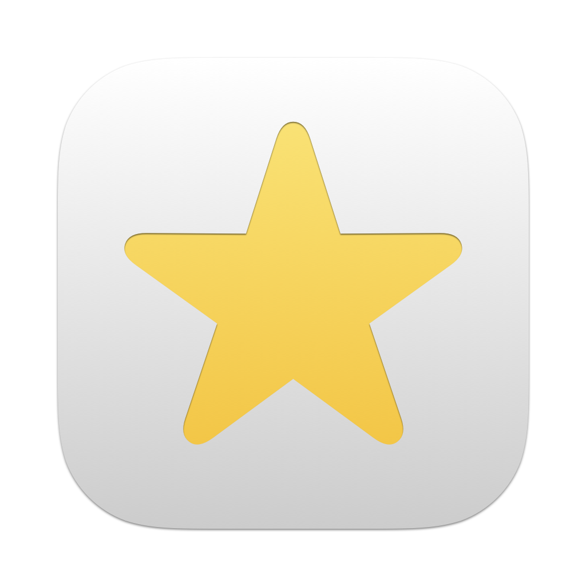

<p align="center">
    
</p>

<p align="center">
    
    
    
        <a href="https://danielsaidi.github.io/BadgeIcon"></a>
    
</p>


# BadgeIcon

BadgeIcon is a SwiftUI library that helps you create beautiful, scalable icons, using SF Symbols or custom assets:

<p align="center">
    
</p>

BadgeIcon comes with 49 predefined icons, and lets you create custom icons with rich customization options. 


## Installation

BadgeIcon can be installed with the Swift Package Manager:

```
https://github.com/danielsaidi/BadgeIcon.git
```


## Getting started

BadgeIcon has 49 predefined icons, like `.alert`, `.bug`, and `.heart`, which will scale to fill the available space:

```swift
struct ContentView: View {

    var body: some View {
        BadgeIcon.calendar
        BadgeIcon.heart.frame(width: 150)
    }
}
```

You can also create your own badge icons, with a rich set of icon and badge style options:

```swift
extension BadgeIcon {

    public static let prominentError = Self(
        icon: MyCustomErrorIcon(),
        style: .init(
            badgeColor: .red
        )
    )
}
```

You can use both `Image` values or custom views as the icon that is shown inside the badge.


## Documentation

The online [documentation][Documentation] has more information, articles, code examples, etc.


## Support my work 

You can [sponsor me][Sponsors] on GitHub Sponsors or [reach out][Email] for paid support, to help support my [open-source projects][OpenSource].

Your support makes it possible for me to put more work into these projects and make them the best they can be.


## Contact

Feel free to reach out if you have questions or want to contribute in any way:

* Website: [danielsaidi.com][Website]
* E-mail: [daniel.saidi@gmail.com][Email]
* Bluesky: [@danielsaidi@bsky.social][Bluesky]
* Mastodon: [@danielsaidi@mastodon.social][Mastodon]


## License

BadgeIcon is available under the MIT license. See the [LICENSE][License] file for more info.


[Email]: mailto:daniel.saidi@gmail.com
[Website]: https://www.danielsaidi.com
[GitHub]: https://www.github.com/danielsaidi
[Bluesky]: https://bsky.app/profile/danielsaidi.bsky.social
[Twitter]: https://www.twitter.com/danielsaidi
[Mastodon]: https://mastodon.social/@danielsaidi
[Sponsors]: https://github.com/sponsors/danielsaidi
[OpenSource]: https://www.danielsaidi.com/opensource

[Documentation]: https://danielsaidi.github.io/BadgeIcon/
[Getting-Started]: https://danielsaidi.github.io/BadgeIcon/documentation/badgeicon/getting-started
[License]: https://github.com/danielsaidi/BadgeIcon/blob/master/LICENSE
