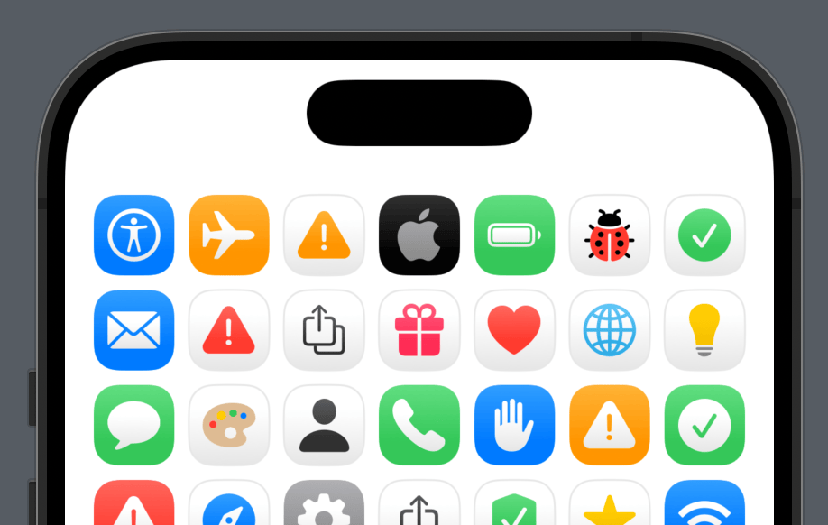

<p align="center">
    
</p>

<p align="center">
    
    
    
    
    <a href="https://twitter.com/danielsaidi"></a>
    <a href="https://mastodon.social/@danielsaidi"></a>
</p>


## About BadgeIcon

BadgeIcon lets you create badge icons that look like the ones you find in iOS and macOS System Settings.

BadgeIcon comes with a bunch of predefined icons:

<p align="center">
    
</p>

You can also create your own icons, with rich icon and badge customization options. 


## Installation

BadgeIcon can be installed with the Swift Package Manager:

```
https://github.com/danielsaidi/BadgeIcon.git
```

If you prefer to not have external dependencies, you can also just copy the source code into your app.


## Getting started

BadgeIcon has some predefined icon types:

* `BadgeIcon.alert`
* `BadgeIcon.appStore`
* `BadgeIcon.bug`
* `BadgeIcon.checkmark`
* `BadgeIcon.email`
* `BadgeIcon.error`
* `BadgeIcon.featureRequest`
* `BadgeIcon.languageSettings`
* `BadgeIcon.lightbulb`
* `BadgeIcon.multicolorPalette`
* `BadgeIcon.person`
* `BadgeIcon.privacy`
* `BadgeIcon.prominentAlert`
* `BadgeIcon.prominentCheckmark`
* `BadgeIcon.prominentError`
* `BadgeIcon.redHeart`
* `BadgeIcon.safari`
* `BadgeIcon.share`
* `BadgeIcon.yellowStar`

You can also create your own badge icons, with custom icon and badge styling.


## Documentation

The [online documentation][Documentation] has more information, code examples, etc. 


## Support my work 

You can [sponsor me][Sponsors] on GitHub Sponsors or [reach out][Email] for paid support, to help support my [open-source projects][GitHub].


## Contact

Feel free to reach out if you have questions or if you want to contribute in any way:

* Website: [danielsaidi.com][Website]
* Mastodon: [@danielsaidi@mastodon.social][Mastodon]
* Twitter: [@danielsaidi][Twitter]
* E-mail: [daniel.saidi@gmail.com][Email]


## License

BadgeIcon is available under the MIT license. See the [LICENSE][License] file for more info.


[Email]: mailto:daniel.saidi@gmail.com
[Website]: https://www.danielsaidi.com
[GitHub]: https://www.github.com/danielsaidi
[Twitter]: https://www.twitter.com/danielsaidi
[Mastodon]: https://mastodon.social/@danielsaidi
[Sponsors]: https://github.com/sponsors/danielsaidi

[Documentation]: https://danielsaidi.github.io/BadgeIcon/documentation/badgeicon/
[Getting-Started]: https://danielsaidi.github.io/BadgeIcon/documentation/badgeicon/getting-started
[License]: https://github.com/danielsaidi/BadgeIcon/blob/master/LICENSE
